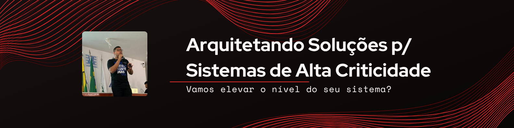

  
  
  <h1 align="center">Olá! Eu sou Guilherme da Invenção 👋</h1>
  
  

    <strong>Engenheiro de Software - Arquiteto de Sistemas | Desenvolvedor Full Stack | Pesquisador de Cibersegurança | Pesquisador de Automações</strong>
  

  

    
    
    
  

---

### 🚀 Sobre Mim

Atuo como Engenheiro de Software com experiência consolidada no desenvolvimento de soluções para setores de alta criticidade, como Gestão Empresarial (ERP) e Saúde. Minha abordagem vai além da escrita de código; tenho foco na arquitetura de sistemas escaláveis, na segurança da informação e na otimização de processos através da tecnologia.

Atualmente, atuo não somente com desenvolvimento de software, mas também aplicando automações em ambientes de saúde para ganho de eficiência operacional e conduzindo pesquisas em Cyber Segurança para garantir a integridade e a resiliência das aplicações.

Minha trajetória é pautada pela adaptabilidade técnica e pelo compromisso com a entrega de software que resolva problemas reais de negócio, integrando boas práticas de engenharia, performance e segurança.

- 🛠️ Focado atualmente em **Escalabilidade de Sistemas** e **Arquiteturas Cloud Native**.
- 🎓 Formação acadêmica pelo **IFS (Instituto Federal de Sergipe)**.
- 🏢 Experiência profissional na **WM Saúde** e **CNPq**, entregando soluções de software de alto impacto.

---

### 💼 Experiência Profissional (Linha do Tempo)

#### **WM Saúde - Gestão e Tecnologia**
*   **Desenvolvedor Júnior** | Março 2026 – Presente (3 meses)
    *   *Efetivado como Desenvolvedor Júnior, ampliando o escopo de atuação para além do suporte e manutenção contínua de sistemas PHP. Atualmente, sou o principal responsável pelo ecossistema e-Smart, responsável pelas automações da Central de Atendimento e ferramentas de gestão de processos.*
*   **Estagiário de Desenvolvimento PHP** | Dezembro 2025 – Fevereiro 2026 (3 meses)
    *   *Atuação no suporte e manutenção de sistemas desenvolvidos em PHP, contribuindo para a estabilidade, correção de falhas e melhoria contínua das aplicações utilizadas pela empresa.*

#### **GeoServer - CNPq**
*   **Desenvolvedor Freelance** | Junho 2025 – Presente (1 ano)
    *   *Desenvolvimento de um software de ponta para o compartilhamento e análise de dados de terras griladas no território brasileiro, utilizando ferramentas online e APIs para visualização de dados.*

#### **BST Networks - Brasil Service Telecom Ltda.**
*   **Desenvolvedor Full Stack Freelance** | Fevereiro 2025 – Maio 2025 (4 meses)
    *   *Full Stack Developer atuando com .NET Framework.*

---

### 💻 Tecnologias Principais

  
  
  
  
  
  
  
  
  
  

---

  
<i>"A única maneira de fazer um excelente trabalho é amar o que você faz."</i>

